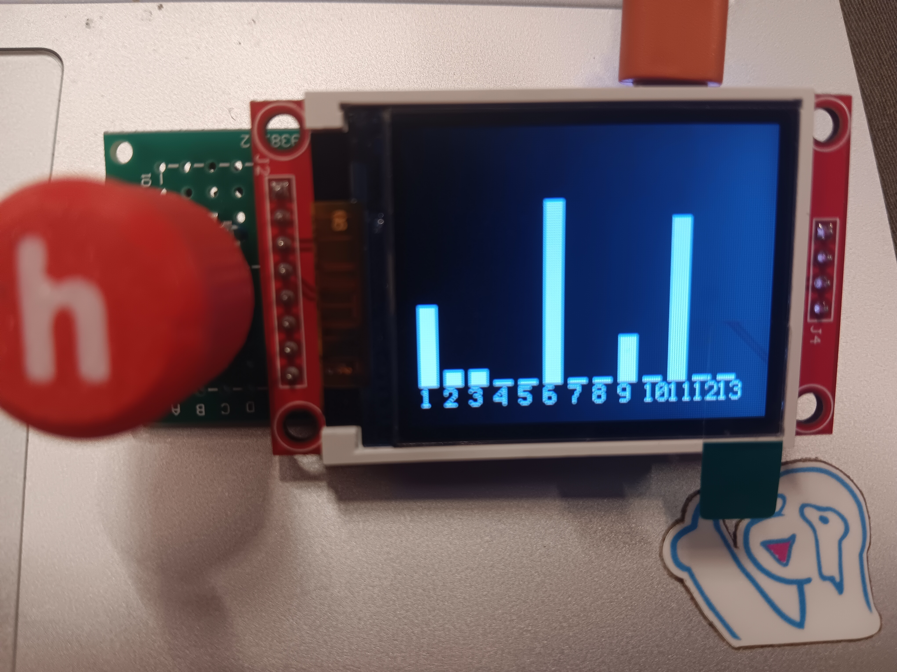
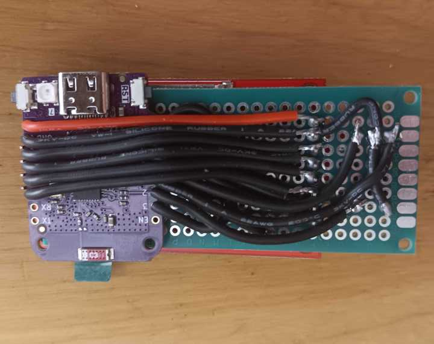

# 1-8-tft-devkit
## Simple devboard setup with a 1.8 inch SPI tft, Wemos C3 mini dev board, and a rotary encoder.
## Made for [Hack Club](https://hackclub.com)'s Undercity
### This is a fairly flexible development kit, but for the demo I show it running a very simple WiFi channel scanner, showing the number of stations on each 2.4GHz channel (provided as `code.py`). Some other things I'm considering for the future are a minimal Slack client, or some sort of over-wifi remote control. Unfortunately a lot of WiFi/USB stuff I wanted to try with it was ruled out, since apparently the esp-32 c3 was not in fact as capable as I though it was. In hindsight, XIAO rp2040 was the way to go.
### Demo: https://youtube.com/shorts/gqPPCHYAOXk


### Wiring:
```
C3-MINI -> 1.8INCH-TFT:

VBUS -> VCC
GND -> GND
6 -> CS
7 -> RESET
8 -> AO
10 -> SDA
5 -> SCK
4 -> LED

C3-MINI -> ENCODER:

GND -> GND
GND -> GND
0 -> LEFT
1 -> RIGHT
2 -> SW
```





### BOM: 

| Qty | Item |
|---|------------------------|
| 1 | Wemos C3 Mini devboard |
| 1 | Rotary encoder |
| 1 | 1.8" SPI TFT display |
| 1 | 70x30mm perf board |